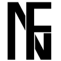
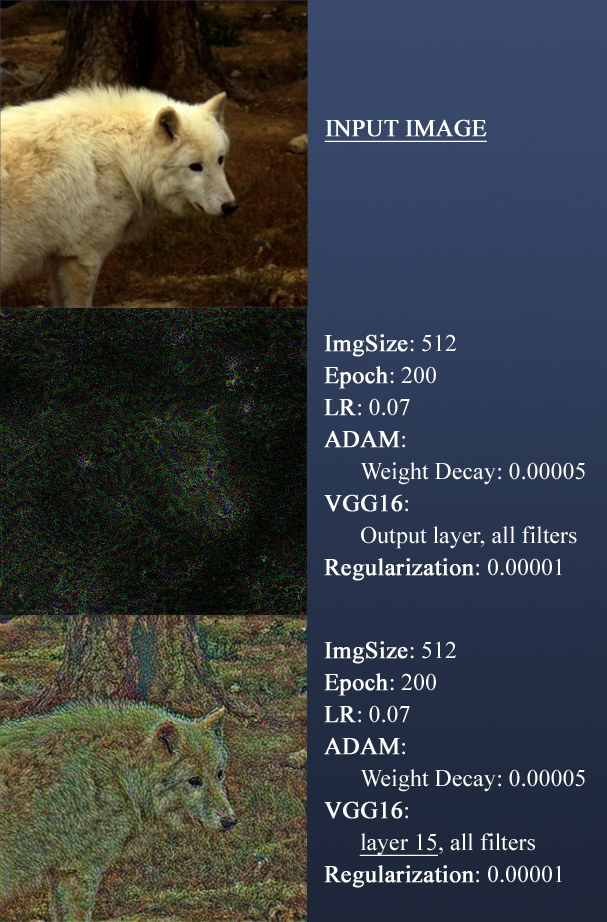
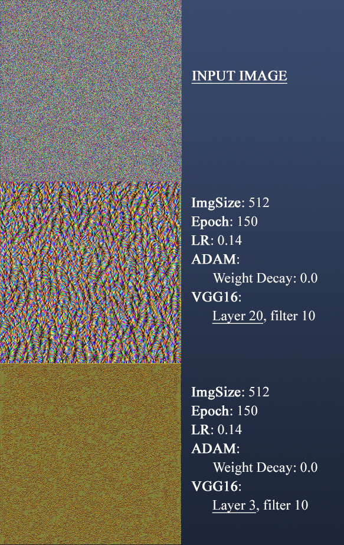
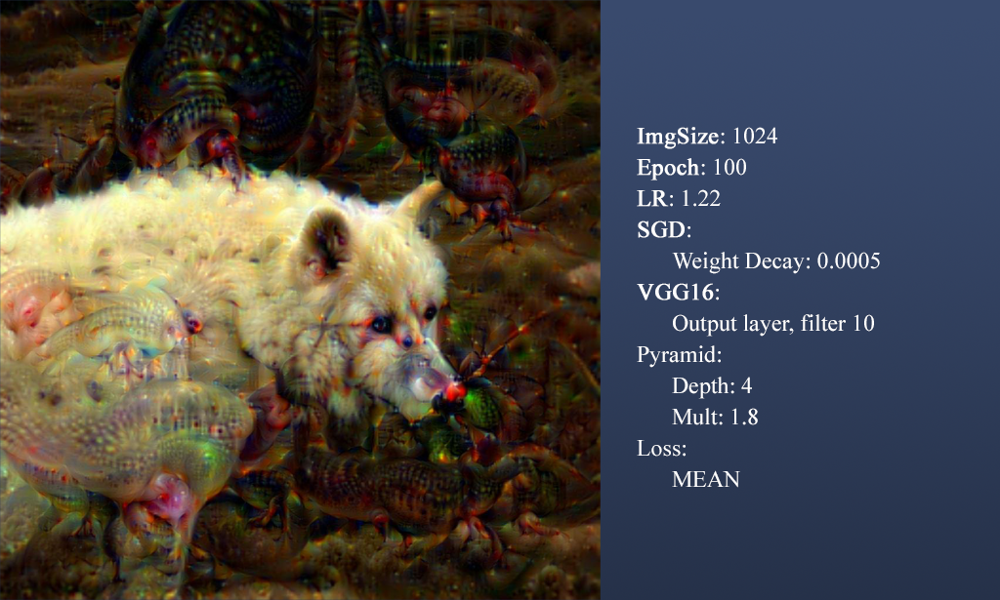
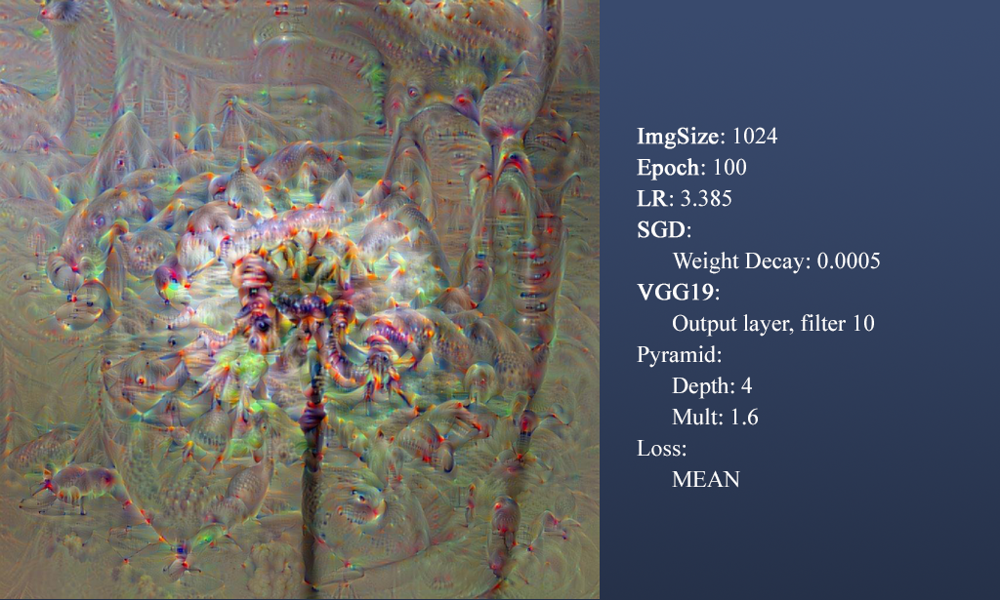

# FlavNET
## _Neural networks visualizer tool_



FlavNET provides tools to unmask, visualize and understand the deepest secrets neural network.<br /><br />
FlavNET has been developed as a project for:<br />
[_**School in AI: Deep Learning, Vision and Language for Industry**_](https://aischools.it/)  
by Jacopo Rizzi and Fabio Andreghetti.

## Overview
FlavNET let's you select between:
- [x] Inverse Representation
- [x] Deep Dream
- [x] Filter Visualization
- [ ] Style Transfert (future update)
- [ ] ... imagination is the limit

Each tab has its own parameters.


## Installation
Install pip:
```
sudo apt install python3-pip
```
Clone repo:
```
sudo apt clone https://github.com/Blue-Skeptical/FlavNET.git
cd FlavNET/
```
Setup PYTHONPATH variable:
```
export PYTHONPATH=$PYTHONPATH:/path/to/directory/
```
Install required modules:
```
pip3 install -r required.txt
```
LAUNCH :fire: :
```
cd GUI/
python3 flavNET_GUI.py
```

*Warnings:*
- *Generated images will be saved inside /GUI/generated/ folder, make sure to have such folder in the correct place*
- *Provide only .jpg or .jpeg*

# Inverse Representation
During __inverse representation__, a target image is used to produce an output. Such output is our target output.<br />
Selected network is fed with an input image. During each step, this input image is optimized to make its output match our target output. <br />
The result should be something colse to our initial target image.<br />
Levels with high index (close to the network's end) are more difficult to be inverted, hence the output image will be noisy.
Levels with low index (close to the network's begin) are less difficult to be inverted, the output image will be almost the same as the input image. <br />
Our loss function will be:
```
mse_loss(layer_output, target_output) + regularise
```

Here some examples:<br />
_Thanks for nabster the [image](https://pixabay.com/de/photos/tier-hirsch-tiere-s%c3%a4ugetier-gut-985126/)_
<br />


# Filter Visualization
Using a different loss function we get a filter visualizator. During __filter visualization__, we feed our network with a noise and optimize the input image over the output of a specific layer. <br />
Lower layers' filters show basic colours and patterns. Going toward the network's output we get more complex filters. <br />
Our loss function will be: <br />
```
-mean(layer_output) <br />
```
Here some examples: <br />


# Deep Dream
If, in filter visualization, we use a real image rather than a random noise, we get a deep dream.
During __deep dreaming__, for artistic reasons, we also use a technique called _pyramid image_.
This technique consists in feeding the network with a different scaled versions of the input image. This way, our network can _dream_ a "global" feature (the ratio between the receptive field and the input image changes). As the size increase, the _dreamed_ features are generated in a more local context.<br />
Deep dreaming is very dependents to the network used. <br />
Here some examples: <br />

<br />

<br />
# ... for more:
Follow FlavNET on [instagram](https://www.instagram.com/flavnet/)! <br />

