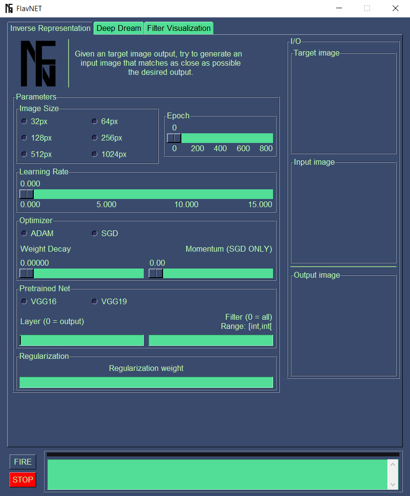

# FlavNET
## _Neural networks visualizer tool_


FlavNET provides tools to unmask, visualize and understand the deepest secrets neural network.<br /><br />
FlavNET has been developed as a project for:<br />
[_**School in AI: Deep Learning, Vision and Language for Industry**_](https://aischools.it/)  
by Jacopo Rizzi and Fabio Andreghetti.

## Overview
FlavNET let's you select between:
- [x] Inverse Representation
- [x] Deep Dream
- [x] Filter Visualization
- [ ] Style Transfert (future update)
- [ ] ... imagination is the limit

Each tab has its own parameters.



## Begin
Run:
```
python3
```

